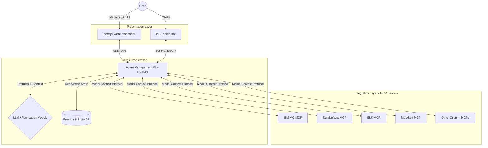
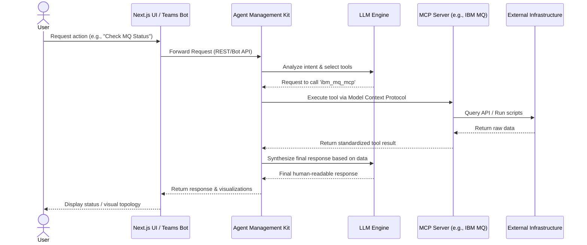

# AIOps Monorepo

Welcome to the **AIOps Monorepo**, a unified platform designed for building, managing, and interacting with AI-driven operations (AIOps) agents. This platform utilizes Large Language Models (LLMs) and the **Model Context Protocol (MCP)** to securely connect autonomous agents to your enterprise infrastructure and tools.

With this platform, agents can autonomously fetch live data, map network topologies, diagnose IT incidents, and trigger self-healing workflows across a variety of integrations.

---

## Architecture Overview

The system is split into three core layers:
1. **Presentation Layer**: How users interact with the system (Web Dashboard or Chat Bot).
2. **Core Orchestration**: The AI Agent manager that handles state, context, LLM interactions, and task routing.
3. **Integration Layer**: The individual MCP servers that provide secure, standardized interfaces to external systems.



---

## Sequence Diagram

This diagram illustrates a typical execution flow when a user requests an autonomous action (e.g., *"Find the root cause of the MQ failure"*):



---

## Example Use Cases

### 1. Automated IBM MQ Diagnostics & Log Analysis
A user asks the Agent to check the health of their messaging infrastructure. The Agent Manager connects with the `ibm_mq_mcp` server, which securely runs `dspmq` to list active Queue Managers and fetches recent system logs. The Agent synthesizes this raw data into a human-readable health summary for the user.

### 2. ServiceNow Incident Triage & Self-Healing
An alert triggers regarding a failure on an enterprise application. The `servicenow-mcp` logs an incident. The Agent Manager intercepts the incident, uses the appropriate MCP (like `rc_connector_mule` or `rc_connector_elk`) to diagnose the root cause, executes a fix (e.g., restarting a service), and finally resolves the ServiceNow ticket with a full summary attached—all autonomously.

### 3. Conversational Infrastructure Management
A DevOps engineer on the go needs to check system health. They ping the MS Teams AIOps Bot: *"Are there any ELK log anomalies in the last 15 minutes?"* The bot routes the request to the Agent Manager, which executes a search via the `rc_connector_elk` MCP, summarizes the errors, and replies directly within the Teams chat window.

### 4. Background Monitoring via Webhook
An external APM tool (like Datadog) detects a database spike and fires a webhook payload to the Agent Manager (`POST /agent/{id}/webhook/invoke/{webhook_id}`). The AI agent launches a background diagnostic workflow, querying system metrics autonomously, and automatically posts its findings to a designated Slack/Teams channel.

### 5. Automated Identity Management (Entra ID)
A user requests a password reset. The Agent connects via the `microsoft_entra_connector` using the Microsoft Graph API, generates a secure password, enforces a password change at next sign-in, and securely provides the temporary credentials to the user, completely eliminating a Tier 1 Helpdesk ticket.

---

## Repository Structure

This monorepo consists of three main sub-projects:

### 1. Agent Management Kit (`aiops-agent-management/`)
The core backend orchestration engine built with **Python and FastAPI**.
- **Role**: Manages the lifecycle of AI agents, maintains conversation/session state, and coordinates tasks between Supervisor Agents and worker sub-agents.
- **Tech Stack**: Python 3.11+, FastAPI, SQLite/Alembic (for state), Uvicorn.
- **Key Feature**: Implements the Model Context Protocol (MCP) client to dynamically discover and use tools from the integration layer.

### 2. Connectors & Chat Bots (`aiops-backend-mcps/`)
Houses specific integrations and alternate user interfaces.
- **`mcp_servers/`**: A collection of isolated Model Context Protocol connectors that bridge the gap between our AI agents and 3rd-party enterprise tools.
  - Examples: `ibm_mq_mcp` (IBM MQ servers), `servicenow-mcp` (ServiceNow incidents), `rc_connector_elk` (Elasticsearch logging), and `rc_connector_mule` (MuleSoft).
- **`teams_bot/`**: A Microsoft Teams bot (`m365agents`) allowing users to chat with the AIOps platform natively in their Teams workspace.

### 3. User Interface (`aiops-frontend/`)
The web-based visual dashboard for the platform.
- **Role**: Provides a frontend UI to interact with the agents, monitor system health, and visualize complex data such as live IBM MQ network topologies.
- **Tech Stack**: **Next.js** (React 19), Tailwind CSS, Lucide React, `@xyflow/react` (for dynamic node/graph visualizers).

---

## Local Development & Execution

The easiest way to run the entire AIOps platform locally is using **Docker Compose**. This will start the Frontend, Agent Manager, Teams Bot, and some core MCP servers simultaneously.

### Prerequisites
- Docker and Docker Compose
- Node.js (v20+) - *If running manually*
- Python 3.11+ - *If running manually*

### 1. Run Everything with Docker Compose (Recommended)

From the root of the repository, simply run:

```bash
docker-compose up --build
```

This will expose the following services:
- **Frontend Dashboard**: [http://localhost:3000](http://localhost:3000)
- **Agent Manager API**: [http://localhost:8000](http://localhost:8000)
- **Teams Bot**: Port 3978
- **IBM MQ MCP**: Port 8001
- **ServiceNow MCP**: Port 8002

*(Note: Ensure you configure any required `.env` variables in `docker-compose.yml` for external connections.)*

---

### 2. Manual Execution (Alternative)

If you prefer to run the components individually without Docker, you can start them in separate terminal windows:

#### Start the Agent Management Kit
```bash
cd aiops-agent-management

# 1. Create and activate a virtual environment
python -m venv .venv
# On Windows:
.venv\Scripts\activate
# On macOS/Linux:
# source .venv/bin/activate

# 2. Install dependencies
pip install -r requirements.txt

# 3. Start the FastAPI server (runs on http://localhost:8000 by default)
uvicorn main:app --host 0.0.0.0 --port 8000 --reload
```

### 2. Start the Frontend Dashboard

Provides the visual interface to monitor and interact with the agents.
```bash
cd aiops-frontend

# 1. Install dependencies
npm install

# 2. Start the development server (runs on http://localhost:3000 by default)
npm run dev
```

### 3. Start Specific MCP Servers or Teams Bot

Depending on what you want to test, you may need to start an MCP server for the Agent Kit to connect to. *Note: You'll typically need to configure `.env` files for external services first.*

**Example: Starting the IBM MQ MCP Server**
```bash
cd aiops-backend-mcps/mcp_servers/ibm_mq_mcp

# Setup env and dependencies
python -m venv .venv
.venv\Scripts\activate
pip install -r requirements.txt

# Run the MCP server
# Note: Refer to the specific MCP server's README for its exact execution command, 
# as MCP servers often run as standard input/output (stdio) processes or SSE servers.
```

**Example: Starting the Teams Bot**
```bash
cd aiops-backend-mcps/teams_bot

python -m venv .venv
.venv\Scripts\activate
pip install -r requirements.txt

# Start the bot (requires M365 developer credentials)
# Refer to the Teams Bot README for setup instructions.
```
