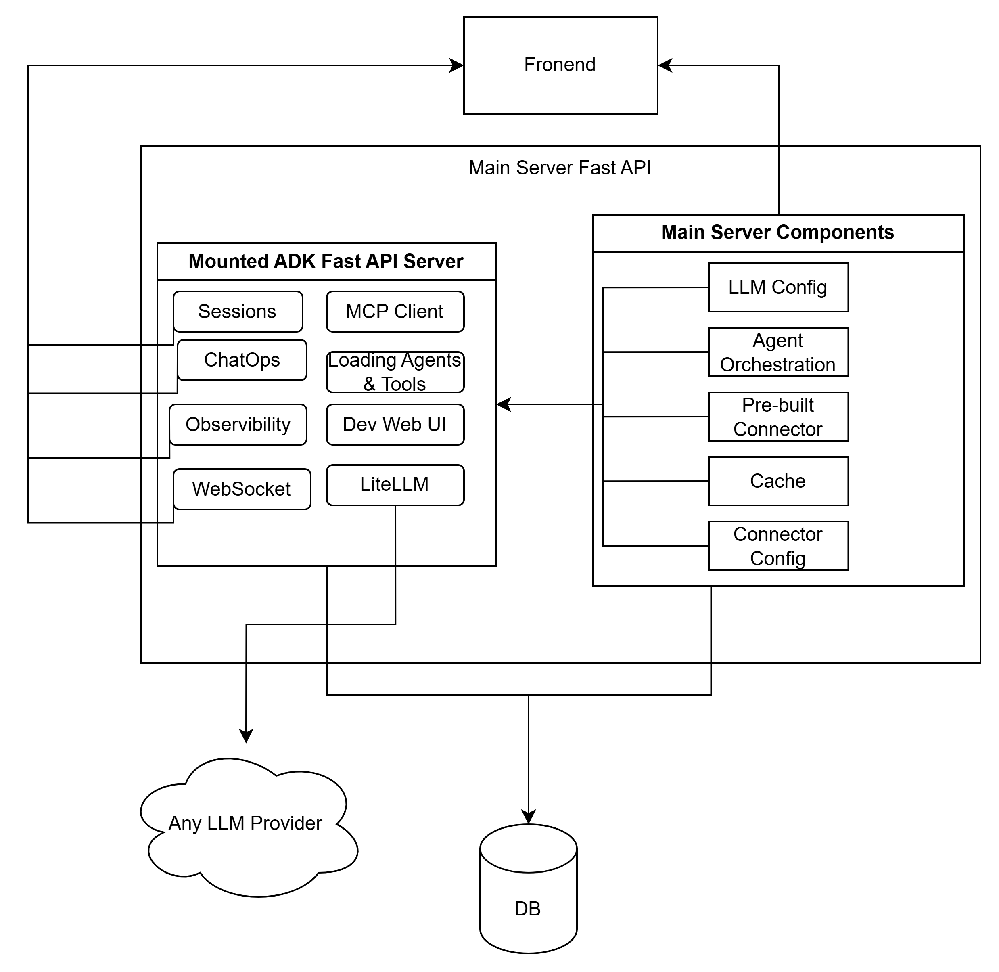

# Agent Management Kit

[](https://github.com/royal-cyber-inc/aiops-agent-management/actions/workflows/main.yml)

A FastAPI-based application for managing and running agents, featuring SQLite/Environment-URL database support, and MCP (Model Context Protocol) integrations.



## Prerequisites

- Python 3.11+ (or Docker)

## Setup Locally

1. **Clone the repository:**
   ```bash
   git clone <repository-url>
   cd agent-management-kit
   ```

2. **Create a virtual environment and install dependencies:**
   ```bash
   python -m venv .venv
   source .venv/bin/activate  # On Windows use: .venv\Scripts\activate
   pip install -r requirements.txt
   ```

3. **Environment Setup:**
   Create a `.env` file in the root directory. You can specify a custom database URL if you don't want to use the default SQLite setup:
   ```env
   DATABASE_URL=sqlite:///agent_management.db
   ```

4. **Run the server:**
   ```bash
   uvicorn main:app --host 0.0.0.0 --port 8000 --reload
   ```

## Running with Docker

You can easily containerize and run the application using Docker.

1. **Build the Docker image:**
   ```bash
   docker build -t agent-management-kit .
   ```

2. **Run the container:**
   ```bash
   docker run -d -p 8000:8000 --env-file .env agent-management-kit
   ```

The application will be available at `http://localhost:8000`. You can access the UI by navigating to `http://localhost:8000/` or access the Agent Server API at `http://localhost:8000/agent-server`.


# Database Migration

```bash
alembic revision --autogenerate -m "added_new_column"
alembic upgrade head
```
# Terminology

- **AI Agent**: A program that can call other agents, tools and connectors to perform tasks autonomously.
- **Tool**: A function that can be called by an agent to perform a specific task.
- **Connector**: Pre-built tools that can connect to an external system (e.g., ServiceNow, Jira) and perform actions on it.
- **MCP**: Model Context Protocol, a protocol for communication between agents and tools.
- **Supervisor Agent**: An agent that can call other agents to perform tasks autonomously.
- **LLM**: Large Language Model, a model that can generate text, code, and other content.
- **Session Storage**: A storage mechanism that can be used to store the state  of an agent with conversation history.

# Deploy on K8s local

## Build your local image
```bash
docker build -t agent-manager:local .
```

## Deploy the manifests
```bash
kubectl apply -f kubernetes/
```

## Check the status
```bash
kubectl get pods
kubectl get services
```

# Push Image to Artifact Registry

```bash
# Authenticate Docker to Artifact Registry
gcloud auth configure-docker us-central1-docker.pkg.dev

# Tag the image
docker tag agent-manager us-central1-docker.pkg.dev/rc-ai-ops-internal/aiops-registry/agent-manager:latest

# Push the image
docker push us-central1-docker.pkg.dev/rc-ai-ops-internal/aiops-registry/agent-manager:latest
```
